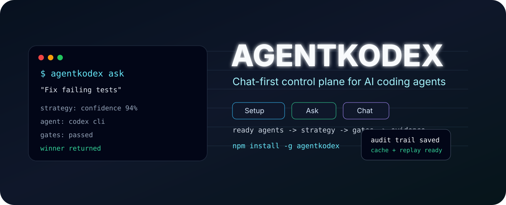

<p align="center">
  
</p>

<p align="center">
  <a href="https://www.npmjs.com/package/agentkodex"></a>
  <a href="https://github.com/Veganjoe966/Agentkodex/actions/workflows/release-gate.yml"></a>
  
  
  
</p>

<h1 align="center">Agentkodex</h1>

<p align="center">
  <strong>The CLI-native operations platform for coding agents.</strong><br>
  Persistent terminals, signed capabilities, quality gates, audit bundles, scorecards, routing, tournaments, and swarm orchestration.
</p>

Agentkodex is the control plane above coding CLIs such as Codex CLI, Claude Code, Aider, Gemini CLI, OpenCode, Cursor CLI, Copilot CLI, shell agents, and custom command agents.

It does not pretend to be the agent. It gives agents a real terminal runtime and wraps every run with policy, memory, approvals, replay, gates, and evidence.

## Install

```bash
npm install -g agentkodex@latest
agentkodex doctor
```

One-shot installer:

```bash
curl -fsSL https://raw.githubusercontent.com/Veganjoe966/Agentkodex/main/install.sh | sh
```

The installer uses npm first, repairs common PATH issues without `sudo`, and falls back to the GitHub package source only if npm is unavailable.

## First Mission

Run inside any project:

```bash
agentkodex quickstart
agentkodex discover
agentkodex quality check --json
agentkodex cockpit
```

Start a persistent Runtime v2 session:

```bash
agentkodex session start \
  --agent shell \
  --command "npm test" \
  --mode sandbox_auto \
  --yes \
  "Runtime smoke"
```

Replay the evidence:

```bash
agentkodex session replay last
agentkodex audit-bundle last --out ./agentkodex-audit
agentkodex audit verify ./agentkodex-audit --json
```

## Why It Exists

Coding agents live or die by their runtime. A serious agent must touch the real project environment:

| Surface | Agentkodex control |
| --- | --- |
| Terminal sessions | Persistent Runtime v2 sessions with attach, send, interrupt, kill, close stdin, and replay. |
| Commands | Policy classification, approvals, scoped capabilities, transcripts, and structured events. |
| Project memory | `.agentkodex/` profiles for stack, commands, errors, runs, sessions, approvals, and intelligence. |
| Completion | Lintguard quality gates, Agentguard security gates, final reports, and blocked completion states. |
| Audit | Redacted evidence, checksummed bundles, changed files, git patches, governance summaries. |
| Multi-agent work | Swarm phases, tournaments, scorecards, and routing based on real local history. |

## Governance Loop

```text
Agent execution
  -> capability validation
  -> security gate
  -> quality gate
  -> audit evidence
  -> scorecards
  -> routing decisions
  -> completion enforcement
```

Agentkodex v1.0.2 passed the local adversarial gauntlet:

- `npm test`: 101/101 passed
- `npm run quality:gate`: passed
- `npm run release:gate`: passed
- public npm install: verified
- audit bundle verification: passed

Read the report: [docs/ADVERSARIAL_VALIDATION_REPORT.md](docs/ADVERSARIAL_VALIDATION_REPORT.md)

## Core Commands

| Command | Purpose |
| --- | --- |
| `agentkodex quickstart` | Initialize project memory, discover commands, rebuild intelligence, and print next steps. |
| `agentkodex discover --json` | Detect stack, package manager, project commands, Docker, Make, Just, Taskfile, and CI evidence. |
| `agentkodex session start` | Launch a persistent agent terminal session. |
| `agentkodex session replay last` | Replay transcript or structured events. |
| `agentkodex quality check --json` | Run Lintguard-backed completion quality checks. |
| `agentkodex governance summary --json` | Show security, capability, quality, approval, and completion signals. |
| `agentkodex keys status` | Inspect Ed25519 capability key status without printing private keys. |
| `agentkodex audit-bundle last` | Package reviewable run/session evidence. |
| `agentkodex route "task"` | Select the best agent from scorecards and project intelligence. |
| `agentkodex tournament --agents ... --task "..."` | Compare agents in isolated workspaces. |
| `agentkodex swarm --builder ... --reviewer ... --qa ...` | Run phased multi-agent orchestration. |
| `agentkodex cockpit` | Start the local browser cockpit for live session control. |
| `agentkodex release gate` | Run the fail-closed release checks. |

## Runtime v2

```bash
agentkodex session start --agent shell --command "node -e 'console.log(123)'" --mode sandbox_auto --yes "Smoke"
agentkodex session list
agentkodex session status last --watch
agentkodex session send last "continue"
agentkodex session interrupt last
agentkodex session kill last
agentkodex session finalize last --gates lint,test,build --yes
```

Runtime artifacts are stored locally:

```text
.agentkodex/runs/<run-id>/
  transcript.log
  session-events.ndjson
  commands.log
  policy.log
  gate-results.json
  final-report.md
  diff.patch
  audit-evidence.jsonl
```

## Agentguard and Lintguard

Agentkodex is the orchestrator.

| Layer | Responsibility |
| --- | --- |
| Agentguard | Capability signing, policy checks, action/path scope, approval pressure, and security audit evidence. |
| Lintguard | ESLint, TypeScript, Ruff, tests, LOC budgets, complexity, dependency hygiene, boundaries, and completion quality. |
| Agentkodex | Runtime sessions, adapters, memory, cockpit, audit bundles, scorecards, routing, tournaments, and swarms. |

Quality config:

```json
{
  "maxFileLoc": 400,
  "maxFunctionComplexity": 12,
  "failOnCircularDeps": true,
  "failOnMissingDeps": true,
  "bannedPackages": ["posthog", "posthog-js"],
  "architectureBoundaries": {
    "src/runtime": ["src/cockpit"]
  }
}
```

Policy config:

```json
{
  "defaultDeny": false,
  "maxCapabilityTtlSeconds": 1800,
  "allowLegacyHmac": true,
  "requireEd25519": false,
  "allowShell": true,
  "allowNetwork": true,
  "allowFileWrite": true
}
```

## Supported Agent Adapters

Agentkodex detects external CLIs honestly. It does not bundle paid or proprietary tools.

| Adapter | Expected executable |
| --- | --- |
| `shell` | explicit `--command` |
| `custom` | configured command template |
| `codex` | `codex` |
| `claude-code` | `claude` |
| `aider` | `aider` |
| `gemini` | `gemini` |
| `opencode` | `opencode` |
| `cursor` | `cursor-agent` |
| `copilot` | `gh copilot` |

Configure your own agent:

```bash
agentkodex agents set custom --cmd "my-agent --prompt-file {promptFile} --cwd {cwd}"
agentkodex run --runtime cockpit --agent custom "Build the billing settings page"
```

## Cockpit

```bash
agentkodex cockpit --host 127.0.0.1 --port 3919
```

Cockpit is local-only by default and requires a bearer token for API routes. Non-loopback binding is refused unless `--unsafe-public` is explicit.

## Documentation

| Doc | What it covers |
| --- | --- |
| [Architecture](docs/ARCHITECTURE.md) | System shape and module boundaries. |
| [Runtime v2](docs/RUNTIME_V2.md) | Persistent sessions, replay, events, and finalization. |
| [Security model](docs/SECURITY_MODEL.md) | Capabilities, policy, Cockpit, daemon, and audit hardening. |
| [Agent operations platform](docs/AGENT_OPERATIONS_PLATFORM.md) | Agentkodex, Agentguard, and Lintguard integration. |
| [Lintguard](docs/LINTGUARD.md) | Quality gate behavior and config. |
| [Agentguard](docs/AGENTGUARD.md) | Capability lifecycle and policy bridge. |
| [Release gate](docs/RELEASE_GATE.md) | Production validation checks. |
| [CLI](docs/CLI.md) | Command reference. |

## Development

```bash
npm install
npm test
npm run quality:gate
npm run release:gate
```

Local checkout:

```bash
node bin/agentkodex.js --help
npm link
agentkodex doctor
```

## Current Limit

Agentkodex provides the runtime, governance, memory, auditability, routing, and completion enforcement. Intelligent code editing still comes from whichever external coding-agent CLI you choose to install.
